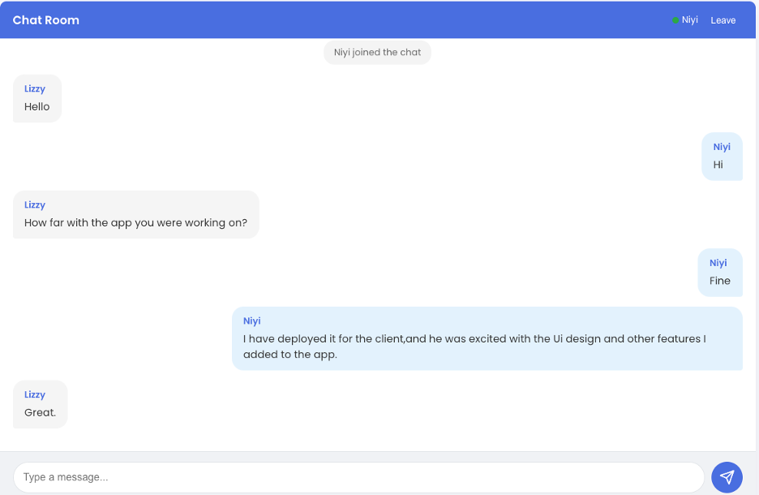

# Reat-Time Chat App
A simple real-time chat application built with:

- **Backend**: Spring Boot with WebSocket and PostgreSQL
- **Frontend**: ReactJS with STOMP over WebSocket

No authentication is required, in an ideal implementation, authenticiation is important.

## Screenshot

> 

## Feature
- Real-time message broadcasting using websocket
- Persistent chat history stored in PostgresQL
- React frontend with live updates using STOMP

# Websocket Endpoints
- Wbsocket endpoint: /ws
- STOMP topic: /topic/public
- STOMP send destination: /app/chat
